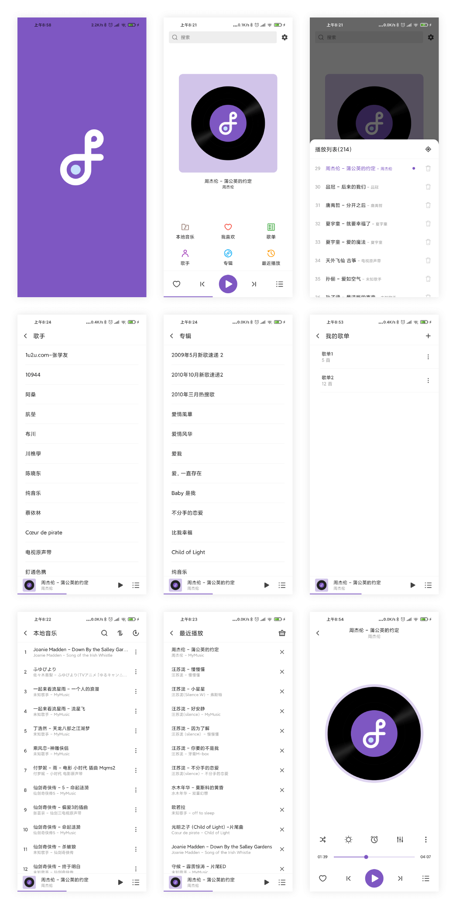

[](./license)
[](https://jitpack.io/#jrfeng/snow)

[**English**](./readme.md)

**如果克隆太慢，或者无法查看图片，请移步：[Gitee](https://gitee.com/jrfeng/snow)**

Android 音乐播放器框架，兼容 MediaSession 。

**支持的功能：**

* 自定义播放器（`MediaPlayer`, `ExoPlayer`）
* 自定义通知栏控制器
* 自定义音频特效引擎
* 仅 WiFi 网络播放
* 切换音质/动态 URL
* 线控播放
* 睡眠定时器
* 记录播放历史
* 播放器状态持久化

**文档：**

* [**快速上手**](https://github.com/jrfeng/snow/wiki/[ZH]-1.%E5%BF%AB%E9%80%9F%E4%B8%8A%E6%89%8B)
* [**PlayerService**](https://github.com/jrfeng/snow/wiki/[ZH]-2.PlayerService)
* [**自定义 PlayerService**](https://github.com/jrfeng/snow/wiki/[ZH]-3.%E8%87%AA%E5%AE%9A%E4%B9%89-PlayerService)
* [**自定义 Notification**](https://github.com/jrfeng/snow/wiki/[ZH]-4.%E8%87%AA%E5%AE%9A%E4%B9%89-Notification)
* [**使用 ExoPlayer**](https://github.com/jrfeng/snow/wiki/[ZH]-5.%E4%BD%BF%E7%94%A8-ExoPlayer)
* [**EqualizerActivity**](https://github.com/jrfeng/snow/wiki/[ZH]-6.EqualizerActivity)

**更多内容：**

* [**Wiki**](https://github.com/jrfeng/snow/wiki)
* [**API Doc**](https://jrfeng.github.io/snow-doc/)

## 示例程序

[**app**](./app) 模块是一个示例程序 —— [下载](https://github.com/jrfeng/snow/releases/tag/1.0.4) 

国内下载：[网盘下载, 提取码：4ubl](https://pan.baidu.com/s/18MRa8MXdiQB-hPUIUjIotg)



## LICENSE

```txt
MIT License

Copyright (c) 2020 jrfeng

Permission is hereby granted, free of charge, to any person obtaining a copy
of this software and associated documentation files (the "Software"), to deal
in the Software without restriction, including without limitation the rights
to use, copy, modify, merge, publish, distribute, sublicense, and/or sell
copies of the Software, and to permit persons to whom the Software is
furnished to do so, subject to the following conditions:

The above copyright notice and this permission notice shall be included in all
copies or substantial portions of the Software.

THE SOFTWARE IS PROVIDED "AS IS", WITHOUT WARRANTY OF ANY KIND, EXPRESS OR
IMPLIED, INCLUDING BUT NOT LIMITED TO THE WARRANTIES OF MERCHANTABILITY,
FITNESS FOR A PARTICULAR PURPOSE AND NONINFRINGEMENT. IN NO EVENT SHALL THE
AUTHORS OR COPYRIGHT HOLDERS BE LIABLE FOR ANY CLAIM, DAMAGES OR OTHER
LIABILITY, WHETHER IN AN ACTION OF CONTRACT, TORT OR OTHERWISE, ARISING FROM,
OUT OF OR IN CONNECTION WITH THE SOFTWARE OR THE USE OR OTHER DEALINGS IN THE
SOFTWARE.
```